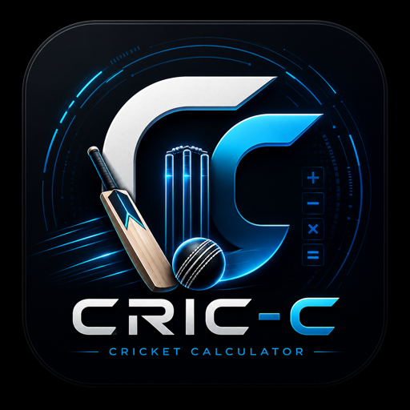

<div align="center">



# 🏏 CRIC-C PRO

### A Sleek, Offline Cricket Scoring App for Android

[](https://www.android.com/)
[](https://kotlinlang.org/)
[](https://developer.android.com/)

> **Real-time cricket scoring in your pocket — no internet needed. Ever.**

</div>

---

## ✅ This is now a real source project

> This branch contains the **buildable Android Studio source** for CRIC-C PRO —
> not a pre-unpacked APK. `./gradlew assembleRelease` actually works now.

```
CRIC-C/
├── settings.gradle.kts · build.gradle.kts · gradle.properties
├── gradle/wrapper/                      # committed wrapper → ./gradlew works out of the box
├── .github/workflows/android-build.yml  # CI builds the APK on every push
└── app/
    ├── build.gradle.kts
    └── src/main/
        ├── AndroidManifest.xml
        ├── java/com/cricc/pro/MainActivity.kt   # hardened WebView host
        ├── assets/index.html                    # the scoring engine (HTML5 + JS)
        ├── assets/logo.png
        └── res/                                 # theme, strings, adaptive icon
```

---

## 🚀 Build from source

**Android Studio:** open the project → let Gradle sync → Run ▶.

**Command line:**

```bash
git clone https://github.com/MANISH-524/CRIC-C.git
cd CRIC-C
./gradlew assembleRelease        # → app/build/outputs/apk/release/app-release.apk
# or a quick test build:
./gradlew assembleDebug
adb install app/build/outputs/apk/debug/app-debug.apk
```

> The first build downloads the Android SDK components / Gradle distribution.
> The committed Gradle wrapper pins Gradle 8.9 (AGP 8.7, Kotlin 2.0.21).

> 📦 **Pre-built APKs** are published under
> [**Releases**](https://github.com/MANISH-524/CRIC-C/releases) — not committed
> into the repo (keeps history small).

---

## 📖 About

**CRIC-C PRO** is a fully offline Android cricket scorer for local matches,
street cricket, and practice games. Ball-by-ball input, live CRR/RRR/target,
two-innings flow, and a ball-by-ball log — with a dark-by-default glass UI.

Architecture: a single-Activity **WebView** hosting an HTML5/JS scoring engine.
The web app is served through `WebViewAssetLoader` over a stable
`https://appassets.androidx.org/` origin so **`localStorage` persistence works
reliably** — an in-progress match now survives the app being backgrounded or
killed.

---

## ✨ Features

- **Ball-by-ball input**: `0 1 2 3 4 6`, `W` wicket, `WD` wide, `NB` no-ball
- **Live stats**: score/wickets, overs, balls remaining, **CRR**, **RRR**, target, runs needed
- **Two-innings flow** with one-tap innings swap and configurable overs
- **Match persistence** *(new)* — auto-saves every ball; restores after an app kill
- **Tie detection** *(fixed)* and **undo** that also clears the winner overlay
- **Winner overlay**, ball-by-ball log, light/dark toggle (theme is remembered)
- **100% offline** — zero permissions, no network, no tracking

---

## 🔒 Permissions

This app requests **zero permissions** — no internet, storage, location, or camera.
Match data lives only in the app's own WebView storage on your device.

---

## 📱 App details

```
Package        : com.cricc.pro
Min Android    : 8.0 (API 26)
Target Android : 15 (API 35)
Gradle / AGP   : 8.9 / 8.7.0      Kotlin : 2.0.21
Architecture   : Single Activity + WebView (HTML5 scoring engine)
```

---

## 👤 Developer

Built with ❤️ by **MANISH** — [@MANISH-524](https://github.com/MANISH-524)

## 📄 License

```
Copyright © 2024 MANISH. All Rights Reserved.
Proprietary software — unauthorized copying, modification, or distribution
is prohibited without explicit permission from the developer.
```
